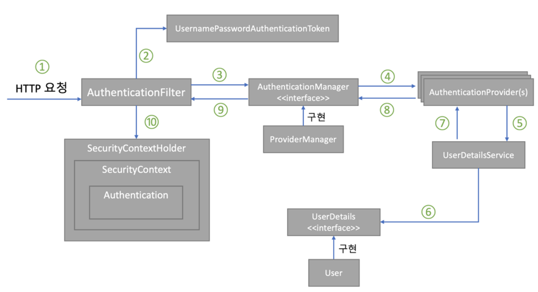

# SpringSecurity
- 스프링 기반의 애플리케이션에서 보안을 담당하는 스프링 하위 프레임워크입니다.
- 보완 관련 옵션을 많이 제공하고 CSRF 공격등을 막아주고 요청 헤더도 보안 처리를 해주기 때문에 개발자가 보안 관련 개발을 해야하는 부담을 줄여줍니다.
- 스프링 시큐리티는 필터 기반으로 동작하고 필터는 Dispactcher Servlet으로 가기전에 적용되므로 가장 먼저 URL 요청을 받습니다. 

## 인증과 인가
### 인증 Authentication
- 사용자의 신원을 확인하는 과정입니다. 쉽게 말해서 로그인을 할때 해당 유저가 누구인지 확인하는 과정입니다.
### 인가 Authorization
- 사용자의 권한을 확인하는 과정입니다. 쉽게 말해서 관리자 페이지에 들어갈 수 있는 권한인지 확인하는 과정입니다.

## 스프링 시큐리티 필터


스프링 시큐리티는 이러한 필터들로 이루어져 있으며 각 필터엔 인증과 인가에 관련된 작업들을 처리합니다.

**SecurtiyContextPersistenceFilter**부터 시작하여 **FilterSecurityInterceptor**까지 순서대로 필터를 거칩니다.

원한다면 필터를 제거하고 커스텀 필터를 넣는 설정도 가능하며 가장 중요한 부분은
**UsernamePasswordAuthenticationFilter** 와 **FilterSecurityInterceptor** 입니다.

**UsernamePasswordAuthenticationFilter**  : 아이디와 패스워드를 받는 다면 인증 요청을 위함하는 인증 관리자 역할을 합니다.

**FilterSecurityInterceptor** : 권한 부여 처리를 위임해 접근 제어 결정을 쉽게하는 접근 결정 관리자 역할을 합니다.

---

## 스프링 시큐리티 인증 처리 과정



1. 사용자가 폼에 아이디와 패스워드를 입력하면 HTTPServletRequest에 아이디와 비밀번호 정보가 전달됩니다. 이때 AuthenticationFilter가 넘어온 아이디와 비밀번호의 유효성 검사를 진행합니다.

2. 유효성 검사가 끝나면 Authentication의 실제 구현체인 UsernamePasswordAuthenticationToken을 만들어서 넘겨줍니다.

3. 전달받은 인증용 객체인 UsernamePasswordAuthenticationToken을 AuthenticationManager에게 보냅니다.

4. UsernamePasswordAuthenticationToken을 AuthenticationProvider에 보냅니다.

5. 사용자 아이디를 UserDetailService에 보낸다. UserDetailService는 사용자 아이디로 찾은 사용자의 정보를 UserDetails 객체로 만들어 AuthenticationProvider에 전달합니다.

6. DB에 있는 사용자 정보를 가져옵니다.

7. 입력 정보와 UserDetails의 정보를 비교해 실제 인증 처리를 합니다.

8. ~ 10. 까지 인증이 완료되면 SecurityContextHolder에 Authentication을 저장합니다. 인증 성공 여부에 따라 성공시 AuthenticationSuccessHandler, 실패하면 AuthenticationFailureHandler 핸들러를 실행합니다.

---
## Official GSM Spring Security + JWT, OAuth2.0 코드 분석

더모먼트 프로젝트인 Official GSM의 Security 부분의 코드를 분석해보도록 하겠습니다.   
사용한 기술은 Spring Security, JWT, OAuth2.0입니다.

### JWT

- JWT는 인증된 사용자인지 확인하는 방법중 하나인 토큰 기반 인증 방식입니다.
- 스프링 시큐리티는 기본적으로 세션 쿠키 인증 방식을 사용합니다.
- 토큰기반 인증 방식은 서버가 토큰을 생성하여 클라이언트에게 제공하면 클라이언트는 토큰을 저장해두었다가 서버에 요청시 토큰을 함께 보냅니다.   
서버에서는 해당 토큰을 사용하여 사용자를 식별합니다.

- 토큰 기반 인증의 특징으로는
#### 무상태성
- 인증 정보가 담겨있는 토큰이 서버가 아닌 클라이언트에 있어 완전한 무상태로 효율적인 검증을 진행할 수 있습니다.
#### 확장성
- 서버를 확장할 때 상태 관리를 신경 쓸 필요가 없으니 서버 확장에도 용의합니다 !
#### 무결성
- 토큰을 발급한 뒤로 토큰 정보를 변경할 수 없습니다.

#### JWT 구조
- JWT는 HTTP request 헤더 중 Authorization 키 값에 `Bearer + 토큰 값`을 넣어서 보냅니다.
- `.` 을 기준으로 헤더, 내용, 서명으로 이루어져 있습니다.
- 헤더에는 토큰 타입, 해싱 알고리즘 / 내용에는 토큰의 정보인 클레임들이 담겨 있으며 / 서명에는 비밀키 값이 주어집니다. 


### OAuth2.0
- OAuth는 인증 프로토콜중 하나입니다. 인증과 인가를 모두 포함하고 있으며 그 중 **인가**에 좀더 초점이 맞춰져있습니다.
- 사용자가 많이 사용하는 서비스(구글, 카카오, 페이스북 등)의 아이디와 비밃번호로 인증을 제공합니다. 해당 인증 작업은 서비스가 개입하지 않습니다.    
또 사용자의 이름이나 이메일같은 사용자 정보를 가져오는 작업같은 권한을 제공해줍니다.
- 인증은 유저가 직접 권한은 서비스에게 제공을 하는 방식합니다.

### OAuth2.0 FLOW
- Oauth에는 총 4가지의 flow들이 있지만 그 중 많이 사용되는 Authorization code flow에 대해 셜명해보겠습니다.

### Google OAuth Authorization code flow
- OAuth를 진행에 참여하는 주체는 간단하게 유저, 서버, 구글서버 이렇게 나눌 수 있습니다.
- **유저**는 인증을 수행하는 주체이며 **Resource Owner** 라고 부릅니다.
- **서버**는 권한을 위임받는 주체이며 **Client** 라고 부릅니다.
- 구글 서버는 두개로 나누어볼 수 있으며 인증을 검증하고 권한을 부여하는 주체인 **Authrization Server**와
- 인가를 수행하고 리소스를 제공하는 주체인 **Resource Server**가 있습니다.


> user agent 는 웹 브라우저라고 생각하면 편합니다.

### Authrization Grant
- Resource Owner가 Client에 OAuth요청을 보냅니다.
- Client가 user agent 에 로그인 url을 제공해줍니다.
- user agent는 url를 이용하여 로그인 페이지를 제공받는다.


**url의 구조**   
```java
http:// ... ?   
response_type=code    
&client_id=쿨리이언트id   
&redirect_uri=리다이렉트uri   
&scope=스코프
```

**response_type** : oauth flow의 authorization code    
**client_id** : 식별자   
**redirect_uri** : 권한을 받환받는 uri     
**scope** : 허용한 권한들

- 여기서 주의깊게 봐야한 부분은 **Client는 로그인 페이지만 제공**해주고 **실제 인증 부분은 Resource Owner나 Authrization 서버에서만 처리됩니다!**
> 인증과 인가의 대상이 분리되었습니다!   
> OAuth가 탄생한 가장 큰 이유인 인증은 유저가 권한은 서버가 갖는 flow가 적용되었습니다.

- 인증이 유효하다고 판단되면 Authrization Server에서 Authorization code를 반환해줍니다.
- Client는 받은 Authorization code를 사용하여 Authrization Server에 Access Token 발급을 요청합니다.
- 인증이 끝난다면 Authrization Server가 Client에 Access Token을 발급해줍니다.

### Using Resource

- Resource Owner가 Client에 리소스가 필요한 작업을 요청보냅니다.
- Client는 Resource Server에 Access Token과 함께 리소스를 요청합니다.
- Resource Server가 Access Token을 검증 후 리소스를 반환해줍니다.
> 여기서 이야기하는 리소르는 구글 Oauth라면 사용자의 구글 이메일이나 성별, 나이 같은 구글 서버에서 가지고 있는 사용자의 정보입니다.   
> 해당 정보는 요청할 수 있는 리소스를 제한하여 특정 리소스만 Client에서 반환받을 수 있게 설정할 수 있습니다. (위에서 언급했던 scope 설정입니다.)

```ref : [10분 테코톡] 홍실의 OAuth 2.0```

### JWT + OAuth2.0
- OAuth로 로그인 인증 기능을 구현해도 실제 서비스의 인증 방식은 필요합니다.
- 세션 쿠키 같은 인증 방식중 JWT를 사용하여 토큰 기반 인증 방식을 사용한 예시를 분석할 예정입니다.
- 즉 OAuth로는 사용자 이름, 이메일 같은 사용자 정보를 받아오고 서비스의 정보로 사용자를 등록합니다. 사용자는 서버에 요청을 보내는 것을 처리할 때는 JWT 같은 인증 방식이 필요합니다.


### UserDetails, UserDetailsService1

```java
@AllArgsConstructor
@Slf4j
public class AuthDetails implements UserDetails {
    private UserJpaEntity user;

    @Override
    public Collection<? extends GrantedAuthority> getAuthorities() {
        return List.of(new SimpleGrantedAuthority(user.getRole().toString()));
    }

    @Override
    public String getPassword() {
        return null;
    }

    @Override
    public String getUsername() {
        return user.getOauthId();
    }

    @Override
    public boolean isAccountNonExpired() {
        return false;
    }

    @Override
    public boolean isAccountNonLocked() {
        return false;
    }

    @Override
    public boolean isCredentialsNonExpired() {
        return false;
    }

    @Override
    public boolean isEnabled() {
        return false;
    }
}
```
- 유저 정보를 담는 UserDetailes를 implements한 AuthDetails 클래스입니다. 사용자의 인증 정보를 담아 두는 인터페이스 이므로 필수 오버라이드 메서드들이 많다. 
- getAuthorities 메서드는 유저의 역할을 SimpleGrantedAuthority 객체를 List 형태로 리턴합니다.
- getUsername 메서드는 위에서 봤던 5번 동작에서 사용자를 찾아올 때 사용할 username을 리턴합니다.


```java
@Service
@RequiredArgsConstructor
@Slf4j
public class AuthDetailsService implements UserDetailsService {
    private final UserJpaRepository userJpaRepository;

    @Override
    @Transactional(rollbackFor = Exception.class)
    public UserDetails loadUserByUsername(String oauthId) throws UsernameNotFoundException {
        return userJpaRepository.findById(oauthId)
                .map(AuthDetails::new)
                .orElseThrow(() -> new CustomException("User not found.", CustomHttpStatus.NOT_FOUND));
    }
}
```
- UserDetailsService를 implements한 AuthDetailsService입니다.
- loadUserByUsername 메서드를 오버라이딩 해서 사용자 정보를 가져오직을 작성하였습니다.

### Security Config
```java

@Configuration
@EnableWebSecurity
@RequiredArgsConstructor
public class SecurityConfig {
    private final OAuthService oAuthService;
    private final CookieUtil cookieUtil;
    private final ExceptionHandlerFilter exceptionHandlerFilter;
    private final JwtRequestFilter jwtRequestFilter;
    private final AuthenticationFailureHandler authenticationFailureHandler;

    @Bean
    public SecurityFilterChain filterChain(HttpSecurity http) throws Exception {
        http.csrf(AbstractHttpConfigurer::disable);

        http.sessionManagement((sessionManagement) ->
                sessionManagement.sessionCreationPolicy(SessionCreationPolicy.STATELESS)
        );

        http.authorizeHttpRequests((authorizeHttpRequests) ->
                authorizeHttpRequests
                        .requestMatchers("/api/auth/token/refresh").permitAll()
                        .requestMatchers("/api/auth/logout").permitAll()
                        .requestMatchers("/api/auth/userinfo").authenticated()
                        .requestMatchers("/api/auth/username").authenticated()
                        .requestMatchers("/api/auth/unapproved/list").hasAuthority("ADMIN")
                        .requestMatchers("/api/auth/approved/**").hasAuthority("ADMIN")
                        .anyRequest().permitAll()
        );

        http.oauth2Login(oauth -> oauth.userInfoEndpoint(u -> u.userService(oAuthService)));
        http.oauth2Login(oauth -> oauth.failureHandler(authenticationFailureHandler));

        http.exceptionHandling(exception ->
                exception.authenticationEntryPoint(new CustomAuthenticationEntryPointHandler(cookieUtil)));

        http
                .addFilterBefore(jwtRequestFilter, UsernamePasswordAuthenticationFilter.class)
                .addFilterBefore(exceptionHandlerFilter, JwtRequestFilter.class);

        return http.build();
    }
}
```

- csrf설정과 url관련 설정을 해줍니다. 접근 권한이 필요한 요청 url들에게는 `.authenticated()`, `.hasAuthority()` 같은 메서드로 접근 권한 설정을 해주었습니다.

### OAuth Service

```java
@Service
@RequiredArgsConstructor
public class OAuthService implements OAuth2UserService<OAuth2UserRequest, OAuth2User> {

    private final OAuth2UserService<OAuth2UserRequest, OAuth2User> delegateOauth2UserService = new DefaultOAuth2UserService();
    private final HttpServletResponse httpServletResponse;
    private final UserRepository userRepository;
    private final RefreshTokenRepository refreshTokenRepository;
    private final JwtTokenProvider jwtTokenProvider;
    private final EmailUtil emailUtil;
    private final CookieUtil cookieUtil;
    private final UserMapper userMapper;

    @Value("${domain}")
    private String schoolDomain;

    @Override
    public OAuth2User loadUser(OAuth2UserRequest userRequest) throws OAuth2AuthenticationException {
        OAuth2User oAuth2User = delegateOauth2UserService.loadUser(userRequest);

        emailCheckLogic(oAuth2User.getAttribute("email"));

        String providerId = oAuth2User.getName();
        String email = oAuth2User.getAttribute("email");

        User user = getUser(providerId, email);
        String nameAttribute = "oauthId";
        Role role = user.role();
        Map<String, Object> attributes = new HashMap<>(Map.of(
                "oauthId", providerId,
                "role", role,
                "userEmail", email,
                "requestedAt", LocalDateTime.now()
        ));
        Collection<GrantedAuthority> authorities = new ArrayList<>(oAuth2User.getAuthorities());
        authorities.add(new SimpleGrantedAuthority(role.name()));

        cookieLogic(userMapper.toEntity(user));

        return new UserInfo(authorities, attributes, nameAttribute);
    }

    private User getUser(String providerId, String email) {
        User savedUser = userRepository.findByOauthId(providerId)
                .orElse(null);

        if (savedUser == null) {
            UserJpaEntity user = UserJpaEntity.builder()
                    .oauthId(providerId)
                    .userEmail(email)
                    .userName(null)
                    .role(UNAPPROVED)
                    .requestedAt(LocalDateTime.now())
                    .build();
            return userRepository.save(userMapper.toDomain(user));
        }
        return savedUser;
    }

    private void emailCheckLogic(String email){
        String emailDomain;

        try {
            emailDomain = emailUtil.getOauthEmailDomain(email);
        }catch (IllegalArgumentException e){
            throw new OAuth2AuthenticationException(e.getMessage());
        }

        if (!emailDomain.equals(schoolDomain)) {
            throw new OAuth2AuthenticationException("학교 이메일이 아닙니다.");
        }
    }

    private void cookieLogic(UserJpaEntity user){
        String accessToken = jwtTokenProvider.generatedAccessToken(user.getOauthId());
        String refreshToken = jwtTokenProvider.generatedRefreshToken(user.getOauthId());
        cookieUtil.addTokenCookie(httpServletResponse, ConstantsUtil.accessToken, accessToken, jwtTokenProvider.getACCESS_TOKEN_EXPIRE_TIME(), true);
        cookieUtil.addTokenCookie(httpServletResponse, ConstantsUtil.refreshToken, refreshToken, jwtTokenProvider.getREFRESH_TOKEN_EXPIRE_TIME(), true);
        RefreshToken entityToRedis = new RefreshToken(user.getOauthId(), refreshToken, jwtTokenProvider.getREFRESH_TOKEN_EXPIRE_TIME());
        refreshTokenRepository.save(entityToRedis);
    }
}
```
- OAuth client를 사용하면 원래 구글 OAuth에 로그인 후 받아온 code로 accessToken을 발급받고 해당 토큰으로 resource서버에 요청을 보내 사용자의 정보를 받아오는 작업을 진행해야하지만   
이러한 작업들을 스프링에서 처리를 해주어서 `/oauth2/authorization/google` 에 접속한다면 구글 로그인 창으로 리다이렉트 되며 로그인 하면 OAuth2UserService로 사용자의 정보가 오게 됩니다.
- DefaultOAuth2UserService로 OAuth2User를 불러옵니다. 불러온 OAuth2User에서 사용자의 정보들을 이용하여 User 객체를 생성하고 사용자 정보를 이용하여 JWT 토큰을 발급받아 response 쿠키에 저장합니다.
- 그 후 DefaultOAuth2User형태로 유저 정보를 감싸서 return 해줍니다.
- 해당 부분에서 유저의 이메일이 학교 이메일인지 검사하는 로직도 포함되어있습니다.

### JWT
```java
@Getter
@Component
@RequiredArgsConstructor
@Slf4j
public class JwtTokenProvider implements TokenProvider {
    @Value("${jwt.accessSecret}")
    private String accessSecret;
    @Value("${jwt.refreshSecret}")
    private String refreshSecret;
    private final AuthDetailsService authDetailsService;
    @Getter
    private final long ACCESS_TOKEN_EXPIRE_TIME = 60 * 60 * 2 * 1000L;
    @Getter
    private final long REFRESH_TOKEN_EXPIRE_TIME = ACCESS_TOKEN_EXPIRE_TIME * 12;

    @AllArgsConstructor
    public enum TokenType{
        ACCESS_TOKEN,
        REFRESH_TOKEN
    }

    private Key getSignInKey(String secretKey){
        byte[] bytes = secretKey.getBytes(StandardCharsets.UTF_8);
        return Keys.hmacShaKeyFor(bytes);
    }

    private String generatedToken(String oauthId, String type, String secret, long expiredTime){
        final Claims claims = Jwts.claims();
        claims.put("oauthId", oauthId);
        claims.put("type", type);
        return Jwts.builder()
                .setClaims(claims)
                .setIssuedAt(new Date(System.currentTimeMillis()))
                .setExpiration(new Date(System.currentTimeMillis()+expiredTime))
                .signWith(getSignInKey(secret), SignatureAlgorithm.HS256)
                .compact();
    }

    public String generatedAccessToken(String oauthId){
        return generatedToken(oauthId, TokenType.ACCESS_TOKEN.name(), accessSecret, ACCESS_TOKEN_EXPIRE_TIME);
    }

    public String generatedRefreshToken(String oauthId){
        return generatedToken(oauthId, TokenType.REFRESH_TOKEN.name(), refreshSecret, REFRESH_TOKEN_EXPIRE_TIME);
    }

    private Claims getTokenBody(String token, String secret){
        try {
            if (token == null || token.isEmpty())
                throw new JwtException("Invalid Token");

            return Jwts.parserBuilder()
                    .setSigningKey(getSignInKey(secret))
                    .build()
                    .parseClaimsJws(token)
                    .getBody();
        } catch (ExpiredJwtException e) {
            throw new CustomException("Expired Token", CustomHttpStatus.UNAUTHORIZED);
        } catch (JwtException e) {
            throw new CustomException("Invalid Token", CustomHttpStatus.UNAUTHORIZED);
        }
    }

    private Claims getRefreshTokenBody(String token, String secret){
        try {
            return Jwts.parserBuilder()
                    .setSigningKey(getSignInKey(secret))
                    .build()
                    .parseClaimsJws(token)
                    .getBody();
        } catch (ExpiredJwtException e) {
            throw new CustomException("Expired RefreshToken", CustomHttpStatus.UNAUTHORIZED);
        } catch (JwtException e) {
            throw new CustomException("Invalid RefreshToken", CustomHttpStatus.UNAUTHORIZED);
        }
    }

    public UsernamePasswordAuthenticationToken authentication(String token){
        UserDetails userDetails = authDetailsService.loadUserByUsername(getTokenOauthId(token, accessSecret));
        return new UsernamePasswordAuthenticationToken(userDetails, null, userDetails.getAuthorities());
    }

    public String getTokenOauthId(String token, String secret){
        return getTokenBody(token, secret).get("oauthId", String.class);
    }

    public String getRefreshTokenOauthId(String token, String secret){
        return getRefreshTokenBody(token, secret).get("oauthId", String.class);
    }

    public long getExpiredAtAccessTokenToLong(){
        return ACCESS_TOKEN_EXPIRE_TIME/1000L;
    }

    public boolean isExpiredToken(String token, String secret) {
        final Date expiration = getTokenBody(token, secret).getExpiration();
        return expiration.before(new Date());
    }

    public boolean isValidToken(String token, String secret) {
        return isExpiredToken(token, secret);
    }

    @Override
    public String getRefreshSecert() {
        return refreshSecret;
    }
}
```
- 유저 정보를 토대로 JWT 토큰을 발급해주는 메서드와 토큰에서 유저 정보를 꺼내오는 메서드, 토큰의 유효성을 검사하는 메서드들이 작성되어있습니다.
- authentication 메서드는 loadUserByUsername 메서드를 실행시켜 UserDetails객체를 가져오고 해당 객체로 UsernamePasswordAuthenticationToken 객체를 생성하여 리턴해줍니다.

### JWT RequestFilter

```java
@Component
@RequiredArgsConstructor
@Slf4j
public class JwtRequestFilter extends OncePerRequestFilter {
    private final BlackListRepositoryImpl blackListRepository;
    private final UserRepository userRepository;
    private final JwtTokenProvider jwtProvider;
    private final CookieUtil cookieUtil;
    private final UserUtil userUtil;

    @Value("${jwt.accessSecret}")
    private String accessSecret;

    @Override
    protected boolean shouldNotFilter(HttpServletRequest request) throws ServletException {
        String path = request.getRequestURI();
        return path.equals("/api/auth/token/refresh");
    }

    @Override
    protected void doFilterInternal(HttpServletRequest request, HttpServletResponse response, FilterChain filterChain) throws ServletException, IOException, CustomException {
        String token = cookieUtil.getCookieValue(request, ConstantsUtil.accessToken);

        if (token != null) {
            Optional<BlackList> blackList = blackListRepository.findByAccessToken(token);
            if (blackList.isPresent() && token.equals(blackList.get().accessToken())) {
                throw new CustomException("Invalid Token", CustomHttpStatus.UNAUTHORIZED);
            }
            UsernamePasswordAuthenticationToken auth = jwtProvider.authentication(token);
            SecurityContextHolder.getContext().setAuthentication(auth);
        }

        filterChain.doFilter(request, response);
    }
}
```

- 해당 JwtRequestFilter는 UsernamePasswordAuthenticationFilter 가 실행되기 전에 실행되어 사용자가 요청에 같이 보낸 토큰을 꺼내어 토큰 정보를 바탕으로 사용자의 인증 작업을 진행해주는 커스텀 필터입니다.
- 필터 등록은 아래와 같이 SecurityConfig에 addFilterBefore 메서드를 사용하여 설정해주었습니다.

```java
   http.addFilterBefore(jwtRequestFilter, UsernamePasswordAuthenticationFilter.class);
```

- 상속 받은 OncePerRequestFilter는 효율적인 리소스 관리를 위해서 사용자의 요청당 딱 한번만 실행되는 필터를 만들어주는 클래스입니다.
- 요청이온 request에 쿠키에서 토큰을 꺼내어 유효성 검사 후 토큰의 정보로 UsernamePasswordAuthenticationToken 객체를 만들어 SecurityContextHolder에 저장하여 인증 작업을 진행합니다.

---

Spring Security, JWT, OAuth2.0 에 인증-인가 작업에 대해 알아보았습니다. 