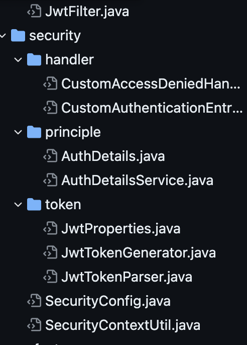

## Spring Security

Spring Security is a powerful and highly customizable authentication and access-control framework. It is the de-facto standard for securing Spring-based applications.

스프링 시큐리티 공식문서 맨 첫번째 페이지에서 가져온 문장입니다.

스프링 시큐리티는 강력하고 사용자 정의가 가능한 인증과 접근 제어 프레임워크입니다.
스프링 기반 애플리케이션 보안을 위한 사실상 표준입니다.

다음과 같은 세 가지의 기능을 제공하고 있습니다.

1. 사용자 인증: 사용자가 제공한 자격 증명을 확인하여 인증합니다.
2. 권한 부여: 사용자에 대한 권한을 부여하고, 요청된 작업을 허용 또는 거부합니다.
3. 보안 설정: URL 기반 또는 메소드 기반 보안 설정을 통해 특정 리소스에 대한 접근을 제어합니다.


<br>

그리고 이번 글에서는 다음과 같은 내용들을 알아볼 것입니다.

1. Spring Security의 사용자 인증 동작 원리
2. 프로젝트 적용 사례, 코드 분석

<br>

## Spring Security의 사용자 인증 동작 원리

Spring Security에서는 기본적으로 세션 - 쿠키 방식을 사용하고 있습니다.

Spring Security는 기본적으로 인증 작업을 거치게 되며 인가 방식으로 접근한 리소스에 대한 권한이 있는지 확인합니다.

Principal/Credential 방식의 인증방식을 사용하는데 쉽게 생각해서 Principal은 아이디 Credential는 비밀번호로 생각해주시면 좋습니다.

### 오해
> Jwt와 Spring Security는 같은 개념이 아닙니다. Jwt는 그저 유저를 식별하기 위한 토큰 기반 인증용 도구인 것입니다. Jwt에 담겨져있는 유저 정보 토대로 Spring Security의 인증 인가 객체를 생성할 수 있도록 Filter를 통해 처리해줘야합니다. 관련 내용은 아래 프로젝트 분석에서 한 번 더 언급하겠습니다.


### 동작원리

유명한 사진을 가져와봤습니다. 아래 사진을 토대로 분석해보겠습니다.


1. Http Request를 통해 유저의 정보가 들어옵니다.
   
2. AuthenticationFilter가 해당 요청을 받고 UsernamePasswordAuthenticationToken이라는 인증용 객체를 생성합니다. 해당 객체는 처리할 수 있는 AuthenticationProvider를 찾는데 사용됩니다.
   
3. AuthenticationFilter로 부터 AuthenticationManager가 해당 인증용 객체 (UsernameAuthenticationToken)를 전달받습니다.  AuthenticationManager는 AuthenticationProvider들을 List형태로 가지고있는 클래스입니다. 실제로 인증작업을 처리하는 객체는 AuthenticationProvider인 것입니다.
   
4. AutenticationManager는 전달받은 인증용 객체를 통해 처리가 가능한 Provider가 있는지 찾게되고 있다면 인증용 객체를 전달시킵니다.

5. 인증 절차가 시작되면 AuthenticationProvider 인터페이스가 실행되고 DB에 있는 사용자 정보와 요청으로 받은 사용자 정보가 일치한지 확인합니다.

6. AuthenticationProvider에서 DB유저의 정보를 가져올 때는 UserDetailsService에 loadUserByUsername이라는 메서드를 통해 유저를 가져옵니다. loadUserByUsername의 리턴타입은 UserDetails입니다  UserDetails 타입은 유저 정보를 담고있는 객체라고 생각해주시면 됩니다.
   
   사용자가 보낸 요청의 유저 정보를 가져오려면 
   AuthenticationProvider는 authenticate() 라는 메서드를 오버라이딩합니다. 이 메서드의 파라미터인 인증용 객체로 사용자 요청한 유저 정보를 가져올 수 있습니다.

7. UserDetailsService에 loadUserByUsername으로 가져온 객체와 요청으로 온 사용자 정보를 비교하고 일치하면 Authentication이라는 객체 참조를 리턴하고 일치하지 않으면 예외를 던집니다.

8. Authentication은 인증이 완료된 사용자 정보를 가지고있는 객체입니다. 그리고 이 객체는 SecurityContext 안에 저장되며 SecurityContextHolder안에 SecurityContext를 한번 더 저장합니다.

9. 로그인이 정상적으로 성공되었다면 AuthenticationSuccessHandle을 실행시키고 실패했다면 AuthenticationFailureHandler를 실행합니다.


<br>

## 프로젝트 분석

관련 코드는 [Sundo-Backend](https://github.com/GSM-Not-Easy/Sundo-Backend)라는 프로젝트 리퍼지토리 코드입니다

다음과 같은 코드 구조를 가지고있으며 한번 분석해보겠습니다.



### Handler

> CustomAuthenticationEntryPointHandler도 구조는 비슷합니다.

```java
@Component
@RequiredArgsConstructor
@Slf4j
public class CustomAccessDeniedHandler implements AccessDeniedHandler {

    private final ObjectMapper objectMapper;

    @Override
    public void handle(
            HttpServletRequest request,
            HttpServletResponse response,
            AccessDeniedException accessDeniedException) throws IOException, ServletException {
        log.info("========== AccessDenied ==========");
        sendErrorResponse(response);
    }

    private void sendErrorResponse(HttpServletResponse response) throws IOException {
        response.setCharacterEncoding("utf-8");
        response.setStatus(HttpStatus.FORBIDDEN.value());
        response.setContentType(MediaType.APPLICATION_JSON_VALUE);
        Map<String, Object> map  = new HashMap<>();
        map.put("message", "요청 권한이 없습니다.");
        response.getWriter().write(objectMapper.writeValueAsString(map));
    }

}
```

AccessDeniedHandler를 재정의해 access-denied가 걸리면 http response로 오류메세지를 던져줍니다.

access denied는 해당 유저가 URL에 접근 권한이 없을때 발생합니다.

예를 들면 공지사항은 어드민만 작성이 가능한데, 유저가 공지사항 관련 http url에 접근했을때 발생합니다.


<br>

### UserDetails, UserDetailsService

```java
@RequiredArgsConstructor
public class AuthDetails implements UserDetails {

    private final User user;


    @Override
    public Collection<? extends GrantedAuthority> getAuthorities() {
        return List.of(new SimpleGrantedAuthority(user.getAuthority().toString()));
    }

    @Override
    public String getPassword() {
        return null;
    }

    @Override
    public String getUsername() {
        return user.getId().toString();
    }

    @Override
    public boolean isAccountNonExpired() {
        return true;
    }

    @Override
    public boolean isAccountNonLocked() {
        return true;
    }

    @Override
    public boolean isCredentialsNonExpired() {
        return true;
    }

    @Override
    public boolean isEnabled() {
        return true;
    }
}
```
이건 유저 정보를 담는 UserDetails를 오버라이딩한 AuthDetails 클래스입니다.

getAuthorities에서는 유저의 역할 enum을 SimpleGrantedAuthority로 변환해 list형으로 담아 리턴해줍니다. 쉽게 생각해서 그냥 유저 권한을 식별할 수 있도록 담아주는 것입니다.


getPassword()는 유저의 비밀번호를 리턴하는데 보안문제상 그냥 null을 리턴해줍시다. 

getUsername()에서는 username으로 사용할 정보를 리턴합니다 unique 필드를 리턴해주는게 좋습니다. 여기서는 그냥 userId를 username으로 사용합니다.


```java
@Service
@RequiredArgsConstructor
public class AuthDetailsService implements UserDetailsService {

    private final UserRepository userRepository;

    @Override
    @Transactional(readOnly = true)
    public UserDetails loadUserByUsername(String username) {
        User user = userRepository.findById(Long.parseLong(username))
                .orElseThrow(() -> new GlobalException("Not Found User in AuthDetailsService", HttpStatus.NOT_FOUND));
        return new AuthDetails(user);
    }

}
```

UserDetailsService를 오버라이딩한 AuthDetailsService입니다.

userRepository에서 username을 토대로(여기서는 Long type의 userId가 principal = username) DB에서 유저를 가져와 UserDetails를 오버라이딩한 AuthDetails로 감싸 리턴합니다.

<br>

## Jwt
```java
@Getter
@Component
@RequiredArgsConstructor
public class JwtTokenGenerator {

    private final AuthDetailsService authDetailsService;
    private final JwtProperties jwtProperties;

    public TokenDto.Response generate(Long userId, Authority authority) {
        String accessToken = generateAccessToken(userId, jwtProperties.getAccessSecret(), authority);
        String refreshToken = generateRefreshToken(userId, jwtProperties.getRefreshSecret(), authority);
        LocalDateTime accessExp = getAccessExp();
        LocalDateTime refreshExp = getRefreshExp();
        return new TokenDto.Response(accessToken, refreshToken, accessExp, refreshExp);
    }

    private String generateAccessToken(Long userId, String accessSecret, Authority authority) {
        return Jwts.builder()
                .signWith(Keys.hmacShaKeyFor(accessSecret.getBytes(StandardCharsets.UTF_8)), SignatureAlgorithm.HS256)
                .setSubject(userId.toString())
                .claim("type", JwtProperties.Properties.accessType)
                .claim(JwtProperties.Properties.roleType, authority)
                .setIssuedAt(new Date())
                .setExpiration(new Date(System.currentTimeMillis() + jwtProperties.getAccessExp()))
                .compact();
    }

    private String generateRefreshToken(Long userId, String refreshSecret, Authority authority) {
        return Jwts.builder()
                .signWith(Keys.hmacShaKeyFor(refreshSecret.getBytes(StandardCharsets.UTF_8)), SignatureAlgorithm.HS256)
                .setSubject(userId.toString())
                .claim("type", JwtProperties.Properties.refreshType)
                .claim(JwtProperties.Properties.roleType, authority)
                .setIssuedAt(new Date())
                .setExpiration(new Date(System.currentTimeMillis() + jwtProperties.getRefreshExp()))
                .compact();
    }

    private LocalDateTime getAccessExp() {
        return LocalDateTime.now().plusSeconds(jwtProperties.getAccessExp());
    }

    private LocalDateTime getRefreshExp() {
        return LocalDateTime.now().plusSeconds(jwtProperties.getRefreshExp());
    }
}
```

Jwt Token을 생성하는 Generator 클래스입니다. 해당 클래스는 스프링시큐리티와 별도의 클래스이며 그저 Jwt라는 객체를 담아 리턴해주는 기능만을 가지고있습니다.

위에서 언급한바와 같이 Jwt와 Spring Security는 다른 개념입니다.

Jwt 토큰 정보를 토대로 UsernamePasswordAuthenticationToken을 생성해서 보내야 진짜 인증 작업이 처리됩니다.

```java
@Component
@RequiredArgsConstructor
public class JwtTokenParser {

    private final JwtProperties jwtProperties;
    private final AuthDetailsService authDetailsService;

    public String parseAccessToken(HttpServletRequest request) {
        String header = request.getHeader(JwtProperties.Properties.tokenHeader); // Authorization

        if(header == null || header.isBlank()) {
            return null;
        }

        if(header.startsWith(JwtProperties.Properties.tokenPrefix)) {
            return header.replace(JwtProperties.Properties.tokenHeader, "");
        }

        return null;
    }

    public String parseRefreshToken(String refreshToken) {
        if(refreshToken.isBlank()) {
            return null;
        }

        if(refreshToken.startsWith(JwtProperties.Properties.tokenPrefix)) {
            return refreshToken.replace(JwtProperties.Properties.tokenPrefix, "");
        }

        return null;
    }

	// 인증된 jwt 토큰을 토대로 loadUserByUsername을 수행해 UsernamePasswordAuthenticationToken을 리턴
    public Authentication authentication(String accessToken) {
        UserDetails subject = authDetailsService.loadUserByUsername(getTokenBody(accessToken, jwtProperties.getAccessSecret()).getSubject());
        return new UsernamePasswordAuthenticationToken(subject, "", subject.getAuthorities());
    }

    public Boolean isExpiredRefreshToken(String refreshToken){
        try {
            getTokenBody(refreshToken, jwtProperties.getRefreshSecret()).getSubject();
        } catch (Exception e) {
            return true;
        }
        return false;
    }

    private Claims getTokenBody(String token, String secret) {
        return Jwts.parserBuilder()
                .setSigningKey(Keys.hmacShaKeyFor(secret.getBytes(StandardCharsets.UTF_8)))
                .build()
                .parseClaimsJws(token)
                .getBody();
    }
}
```

request로 들어온 jwt를 파싱해서 검증하는 유틸 클래스입니다. 여기서는 authentication 객체를 리턴하는 기능도 있으며 jwt가 유효한지(null인지 아니면 인코딩 방식이 잘못되었는지)에 관해서는 JwtFilter에서 처리되며, UserDetailsServiec에서 유저 정보를 find합니다. 유저 정보가 DB에 없는 Jwt라면 예외를 던지겠죠? UserNotFound

```java

@RequiredArgsConstructor
public class JwtFilter extends OncePerRequestFilter {

    private final JwtTokenParser jwtTokenParser;

    @Override
    protected void doFilterInternal(
            HttpServletRequest request,
            HttpServletResponse response,
            FilterChain filterChain) throws ServletException, IOException {

        String accessToken = jwtTokenParser.parseAccessToken(request);

        if(!Objects.isNull(accessToken) && !accessToken.isBlank()) {
            Authentication authentication = jwtTokenParser.authentication(accessToken);
            SecurityContextHolder.clearContext();
            SecurityContext context = SecurityContextHolder.getContext();
            context.setAuthentication(authentication);
        }

        filterChain.doFilter(request, response);
    }
}
```

JwtFilter로 request header에 들어온 jwt가 Null인지 빈값인지 검증하고 아니라면 authentication 을 실행해 authentication 객체를 전달받아 SecurityContext에 저장해줍니다.


<br>

## SecurityConfig, ContextUtil

```java
@EnableWebSecurity
@RequiredArgsConstructor
public class SecurityConfig {

    private final JwtTokenParser jwtTokenParser;

    @Bean
    protected SecurityFilterChain filterChain(HttpSecurity http) throws Exception {
        return http.cors()
                .and()
                .csrf().disable()
                .sessionManagement()
                .sessionCreationPolicy(SessionCreationPolicy.STATELESS)
                .and()
                .authorizeRequests()
                .requestMatchers(CorsUtils::isPreFlightRequest)
                .permitAll()

                .mvcMatchers(HttpMethod.GET, "/").permitAll()

                // auth
                .mvcMatchers(HttpMethod.POST, "/auth/student").permitAll()
                .mvcMatchers(HttpMethod.POST, "/auth/teacher").permitAll()

                .anyRequest().authenticated()
                .and()
                .exceptionHandling()
                .authenticationEntryPoint(new CustomAuthenticationEntryPointHandler(new ObjectMapper()))
                .accessDeniedHandler(new CustomAccessDeniedHandler(new ObjectMapper()))
                .and()
                .apply(new FilterConfiguration(jwtTokenParser))
                .and()
                .build();
    }

    @Bean
    protected PasswordEncoder passwordEncoder() {
        return new BCryptPasswordEncoder();
    }
}
```

passwordEncoder를 빈으로 등록한 것 빼고 보면

url 접근 관련할 설정 cors, csrf에 관한 설정등을 해주고 mvcMatcher를 통해서 해당 url로 접근했을때 필요한 권한들도 설정해줍니다. 여기서는 permitAll만 사용되어있지만 hasRole(), hasAuthority() 등으로 유저의 권한도 설정합니다. authenicated()는 접근 권한이 있는지 없는지만 판단합니다

hasRole과 hasAuthority는 같은 작업을 처리합니다 다만 차이는
- hasRole: 사용자가 특정 역할을 가지고 있는지 확인합니다. "ROLE_" 접두사를 자동으로 추가합니다.
- hasAuthority: 사용자가 특정 권한을 가지고 있는지 확인합니다. 접두사를 자동으로 추가하지 않습니다.

다음과 같습니다.

```java
@Component
@RequiredArgsConstructor
public class SecurityContextUtil {

    private final UserRepository userRepository;

    public User currentUser() {
        Authentication authentication = SecurityContextHolder.getContext().getAuthentication();
        Object principal = authentication.getPrincipal();
        if(principal instanceof Long) {
            return userRepository.queryById((Long) principal)
                    .orElseThrow(() -> new GlobalException("Current User Not Found", HttpStatus.NOT_FOUND));
        } else {
            throw new GlobalException("Principal is Not Valid", HttpStatus.UNAUTHORIZED);
        }
    }
}
```


SecurityContext에 등록되어있는 인증 완료된 객체 Authentication의 user principal(userId)를 토대로 db에서 User를 find해 리턴합니다. 쉽게 설명하면 로그인 된 사용자의 정보를 가져오는 것입니다.


<br>

이렇게 스프링시큐리티를 알아보았습니다. 스프링 시큐리티를 사용하지 않아도 스프링에서 인증 인가 작업을 구축할 수 있지만 매우 복잡합니다. 스프링 시큐리티에 대한 이해도를 바탕으로 OAuth2.0도 구현해보거나 다양한 기능들을 사용할 수 있습니다.

<br>

## Spring Security 없이 인증/인가 구현하기

눈물을 머금고 해보겠습니다. @miri ^^

Jwt를 발급, 파싱하는 로직은 위에 설명했던 것과 같고 다음과 같은 작업을 해보겠습니다.

스프링 시큐리티 Authentication 없이 현재 로그인된 사용자 식별

스프링 시큐리티 UserDetails의 Role을 저장하지않고 엔드포인트에 관한 인가작업

### 로그인된 사용자 식별

```java
@Getter
@RequiredArgsConstructor
public class AuthenticatedUser {
	private Long userId;
	private Set<Authority> roles;
}
```

유저의 id와 역할들을 Set으로 담고있는 클래스를 생성해주었습니다. 간단한 예시이기 때문에 2개만 넣었지만 요구사항에 따라 더 추가될 수 있습니다.


```java
@Component
@RequiredArgsConstructor
public class VerifyLoginFilter implements Filter {

	public static final String AUTHENTICATED_USER = "authentcated_user"
	private final ObjectMapper objectMapper;

	private final UserService userService;

	@Override
	public void doFilter(
	ServletRequest request,
	ServletResponse response, 
	FilterChain chain) throws IOException, ServletException {
		HttpServletRequest httpRequest = (HttpServletRequest) request;
		
		// post로 들어온 요청이라면
		if(httpRequest.getMethod().equals("POST")) {
			try {
				// request의 body를 읽어오고
				LoginRequest loginRequest = objectMapper.readValue(request.getReader(), LoginRequest.class);
				// 로그인 검증 작업을 처리 후
				LoginResponse loginResponse = userService.어쨋든로그인검증작업(loginRequest);
				// 성공한 유저였다면
				if(loginResponse.isSuccessValid()) {
					// request에 아까 만들어둔 Authentcated_user 객체를 바디에 담아서 보내줌
					request.setAttribute(AUTHENTICATED_USER, new AuthenticatedUser(loginRequest.getUserId(), loginRequest.getUserRoles()))
				} else {
				// 실패하면 예외 처리
				// throw Excepion
				}
				chain.doFilter(request, response)
			} catch(Exception e) {
				HttpServletResponse httpResponse = (HttpServletResponse) response;
				httpResponse.sendError(HttpStatus.BAD_REQUEST.value());
			}
		}
	}


```

이렇게 필터를 통해 로그인 검증처리를 할 수 있다


이제 설정한 url에 대한 접근 권한 인가처리를 진행해봅시다. 이번에도 필터를 하나 만들게요

```java
```java
@Component
@RequiredArgsConstructor
public class JwtAuthorizationFilter implements Filter {
    // 설정할 url 배열
    private final String[] whiteListUris = new String[]{"/user","/auth/login","/user/hello","*/h2-console*"};

    private final JwtProvider jwtProvider;

    private final ObjectMapper objectMapper;

    @Override
    public void doFilter(ServletRequest request, ServletResponse response, FilterChain chain) throws IOException, ServletException {
        HttpServletRequest httpServletRequest = (HttpServletRequest) request;
        HttpServletResponse httpServletResponse = (HttpServletResponse) response;
        if(whiteListCheck(httpServletRequest.getRequestURI())){
            chain.doFilter(request, response);
            return;
        }
        if(!isContainToken(httpServletRequest)){
            httpServletResponse.sendError(HttpStatus.UNAUTHORIZED.value(), "인증 오류");
            return;
        }
        try{
            String token = getToken(httpServletRequest);
            AuthenticateUser authenticateUser = getAuthenticateUser(token);
            verifyAuthorization(httpServletRequest.getRequestURI(),authenticateUser);
            log.info("값 : {}",authenticateUser.getEmail());
            chain.doFilter(request, response);
        } catch (JsonParseException e){
            log.error("JsonParseException");
            httpServletResponse.sendError(HttpStatus.BAD_REQUEST.value());
        } catch (SignatureException | MalformedJwtException | UnsupportedJwtException e){
            log.error("JwtException");
            httpServletResponse.sendError(HttpStatus.UNAUTHORIZED.value(), "인증 오류");
        } catch (ExpiredJwtException e){
            log.error("JwtTokenExpired");
            httpServletResponse.sendError(HttpStatus.FORBIDDEN.value(), "토큰이 만료 되었습니다");
        } catch (AuthorizationException e){
            log.error("AuthorizationException");
            httpServletResponse.sendError(HttpStatus.UNAUTHORIZED.value(), "권한이 없습니다");
        }
    }

    private boolean whiteListCheck(String uri){
        return PatternMatchUtils.simpleMatch(whiteListUris,uri);
    }
    
	// authroization header가 있는지에 대한 검증
    private boolean isContainToken(HttpServletRequest request){
        String authorization = request.getHeader("Authorization");
        return authorization != null && authorization.startsWith("Bearer ");
    }

	// token의 Bearer를 때고 값을 가져옴
    private String getToken(HttpServletRequest request){
        String authorization = request.getHeader("Authorization");
        return authorization.substring(7);
    }

	// token claim에 들어있는 authenticate user (userId, roles)를 가져옴
	// claim 설정은 따로 JwtGenerator에서 진행해줘야합니다. 관련 값 body에 담아주기
    private AuthenticateUser getAuthenticateUser(String token) throws JsonProcessingException {
        Claims claims = jwtProvider.getClaims(token);
        String authenticateUserJson = claims.get(VerifyUserFilter.AUTHENTICATE_USER, String.class);
        return objectMapper.readValue(authenticateUserJson, AuthenticateUser.class);
    }

	// 여기서는 어드민에 관한 role이 있는지에 대한 인가처리를 진행합니다.
    private void verifyAuthorization(String uri, AuthenticateUser user){
        if(PatternMatchUtils.simpleMatch("*/admin*",uri) && !user.getRoles().contains(Role.ADMIN)){
            throw new AuthorizationException();
        }
    }
}
```

이렇게 스프링 시큐리티 없이는 필터를 만들어서 사용하는 방식이 있을 수 있습니다.

스프링 시큐리티의 Authentication 객체는 저희가 AuthenticateUser를 만들어서 필터를 통해 http request로 온 유저가 로그인에 성공한 유저라면 setAttribute를 통해 AuthenticateUser를 추가해줘 로그인 사용자의 정보를 사용할 수 있습니다.

인가작업도 귀찮지만 Filter를 통해서 패턴이 매치되는지, url이 들어있는지에 대한 로직을 작성해야합니다.

이렇게 보면 스프링시큐리티에 대한 강력한 힘을 다시금 깨달을 수 있겠죠?
